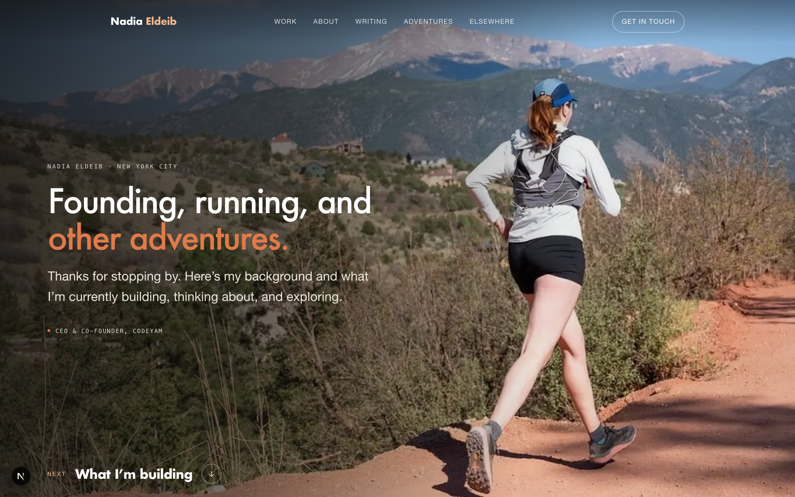

# nadiaeldeib.com

Nadia Eldeib's personal site: work, writing, adventures, and a way to get in touch.

One Next.js route. All copy and photography live in `content/site.json`, so a wording
change is a content diff rather than a code diff. The only datastore is the `Message`
table behind the contact form — there is deliberately no email address anywhere on
the site, so the form is the way in.

## Setup

Requires Node 20 or newer. Run the setup script to install dependencies, initialize
the database, and seed it:

```bash
npm run setup
```

A fresh clone works end to end with `git clone` → `npm run setup` → `npm run dev`.

## Development

Start the dev server:

```bash
npm run dev
```

Open [http://localhost:3000](http://localhost:3000) in your browser.

## Using CodeYam Editor

This project was built with [CodeYam](https://codeyam.com). To launch the editor:

```bash
codeyam editor
```

The editor provides a live preview alongside a Claude Code terminal for iterating on the app.

## Deployment

Hosted on Vercel, deployed from this repo. Pushing to `main` ships to production;
any other branch or pull request gets its own preview URL, so a change can be
clicked through before it is real.

`nadiaeldeib.com` is the canonical address, and it is the only one advertised.
`www.nadiaeldeib.com` and both forms of `nseldeib.com` are registered on the same
Vercel project as 301 redirects to it, so every path ends at one address. The
origin is declared once in `app/lib/siteUrl.ts`; the document metadata, `robots.ts`
and `sitemap.ts` all read from it rather than repeating the domain.

DNS for `nadiaeldeib.com` is a Squarespace registration on Google Cloud nameservers:
two `A` records for the apex and a `CNAME` for `www`, both pointing at Vercel. There
are deliberately no `AAAA` records — Vercel publishes no IPv6 address for apex
domains, and IPv6 clients fall back to IPv4 cleanly.

The site was previously served by GitHub Pages from this branch's root. That is
retired; the pre-rebuild site remains on the `v1-original-site` branch.

## Content

Copy and photography are data, not markup. `content/site.json` holds every section's
words, links, and image references; `content/site.ts` types it. Editing the site's
text means editing that file — no component changes.

## Database

This project uses Postgres via Prisma, hosted at Neon. The single `Message` model
stores notes sent through the contact form. A row is written before delivery is
attempted, so a message survives a mail outage with `emailedAt` left null rather
than being lost.

`DATABASE_URL` has no local fallback — the app throws at startup without it. See
DATABASE.md for where the connection string goes.

Common commands:

```bash
npm run db:push            # Apply schema changes and generate Prisma client
npm run db:seed            # Seed the database with demo data
npm run db:drop-and-reseed # DESTRUCTIVE: drop every table, recreate, re-seed
```

## Scripts

| Script             | Description                                  |
| ------------------ | -------------------------------------------- |
| `npm run setup`    | One-line project setup (install + db + seed) |
| `npm run dev`      | Start the development server                 |
| `npm run build`    | Build for production                         |
| `npm run test`     | Run tests                                    |
| `npm run db:push`  | Apply Prisma schema changes                  |
| `npm run db:seed`  | Seed the database                            |
| `npm run db:drop-and-reseed` | **Destructive.** Drops every table, then re-seeds |

<!-- codeyam:run-and-edit:start -->
## Develop this project with codeyam-editor

This project is built with [codeyam-editor](https://codeyam.com) — code and runnable data scenarios are authored side by side against a live preview.

```bash
# Clone the repo
git clone https://github.com/nseldeib/nadia-website && cd nadia-website

# Install codeyam-editor
npm install -g @codeyam-editor/codeyam-editor@latest

# Launch the editor (split-screen terminal + live preview)
codeyam-editor start
```
<!-- codeyam:run-and-edit:end -->

<!-- codeyam:scenario-gallery:start -->
## Scenario gallery

States captured as runnable scenarios with codeyam-editor:

### Home - Full page



### Home - Mobile


<!-- codeyam:scenario-gallery:end -->
